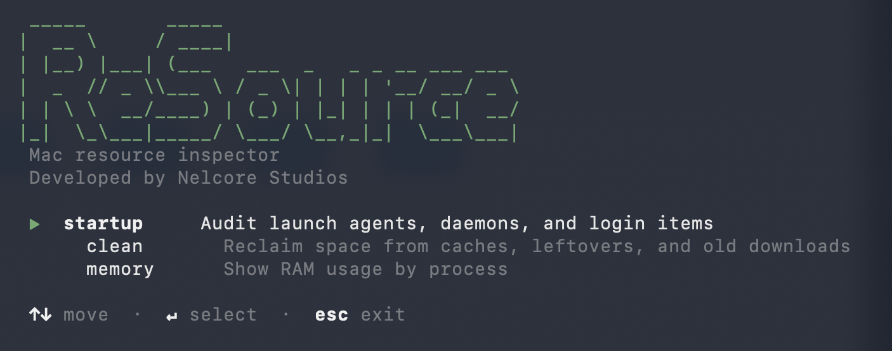

# ReSource

A macOS terminal tool for auditing startup items, reclaiming disk space, and monitoring memory. Built for people who want to know what's running on their machine and clean it up without installing a GUI app.



## Features

### Disk
Surfaces what `du`-based tools miss: APFS purgeable space, local Time Machine snapshot sizes, and a breakdown of your home directory sorted by size.

### Startup
Scans LaunchAgents, LaunchDaemons, and modern login items (via `sfltool dumpbtm` for apps registered with `SMAppService`). Flags "dead" entries — plists that point to executables that no longer exist. Navigate the list, select items, and delete them to Trash with `⌫`. System-owned items are moved via `sudo`. Login items without a backing plist show a reminder to use System Settings.

### Clean
Scans known-safe cache and artifact locations and shows how much space each one takes. All items are pre-selected — deselect anything you want to keep, then `⌫` to move the rest to Trash.

Scanned locations:
- Xcode DerivedData (per-project)
- Xcode Device Support (iOS, tvOS, watchOS, xrOS)
- Unavailable iOS Simulators
- Simulator & CoreSimulator logs
- Crash & diagnostic reports
- Homebrew download cache
- npm, Yarn, pnpm, pip caches
- Rust / Cargo cache (`~/.cargo/registry` and `~/.cargo/git`)
- Gradle, Maven, CocoaPods, Swift Package Manager caches
- Browser caches (Safari, Chrome, Firefox, Arc, Brave, Edge)
- Old Downloads — files in `~/Downloads` older than a configurable threshold (default: 1 year)
- App Leftovers — orphaned support files, containers, and preferences from apps no longer installed
- Dead Agent Leftovers — library remnants cross-referenced with dead LaunchAgent entries found by `resource startup`

All scans run in parallel for fast results. Settings (download age threshold, excluded paths) are saved to `~/.config/resource/config.json` and editable with `resource config`.

### Memory
Shows a live breakdown of system RAM and top processes sorted by usage — same categories as Activity Monitor (Used, App, Wired, Compressed, Cached, Free).

## Requirements

- macOS 14 (Sonoma) or later
- Swift 6 (Xcode 16+)

## Install

**Homebrew (recommended)**

```bash
brew install GNelster/resource/resource
```

Or as two steps:
```bash
brew tap GNelster/resource
brew install resource
```

**Build from source**

```bash
git clone https://github.com/GNelster/ReSource.git
cd ReSource
swift build -c release
sudo cp .build/release/ReSource /usr/local/bin/resource
```

Then just type `resource` in any terminal window.

## Usage

```
resource           # interactive menu
resource disk      # analyze disk usage
resource startup   # jump straight to startup audit
resource clean     # jump straight to clean
resource memory    # jump straight to memory
resource config    # view and edit settings
```

### Keyboard shortcuts

| Key | Action |
|-----|--------|
| `↑` / `↓` | Move cursor |
| `↵` or `Space` | Toggle selection |
| `⌫` (Delete) | Move selected items to Trash |
| `Esc` or `q` | Back / quit |

## Running on a Mac without Xcode

If you're installing a pre-built binary on someone else's Mac, macOS will block it because it isn't signed by a known developer. To get around this, right-click the binary in Finder and choose **Open**, then click **Open** again when prompted. After that first approval it runs normally.

Or from Terminal:
```bash
xattr -dr com.apple.quarantine /usr/local/bin/resource
```

## Project structure

```
Sources/ReSource/
  ReSource.swift          # entry point, main menu
  Commands/               # argument-parser subcommands
  Startup/                # launch item scanning and list view
  Clean/                  # cache scanning and list view
  Memory/                 # memory snapshot and process list
  TUI/                    # raw terminal, menu, key reading
  Output/                 # spinner, progress bar, styles
  Utils/                  # shell runner, formatter, prompt
```

## Built with

- [swift-argument-parser](https://github.com/apple/swift-argument-parser)
- Swift 6, macOS 14+
- No other dependencies

---

Built by [Nelcore Studios](https://portfolio.nelsonarrangements.com)
